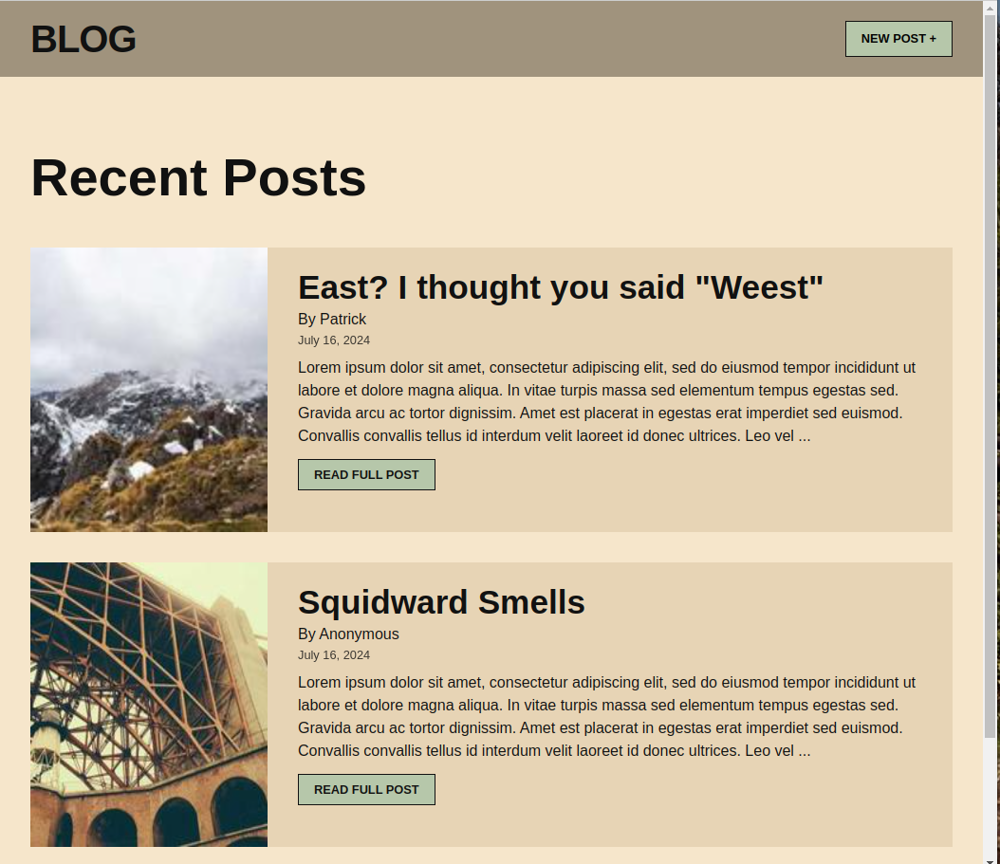
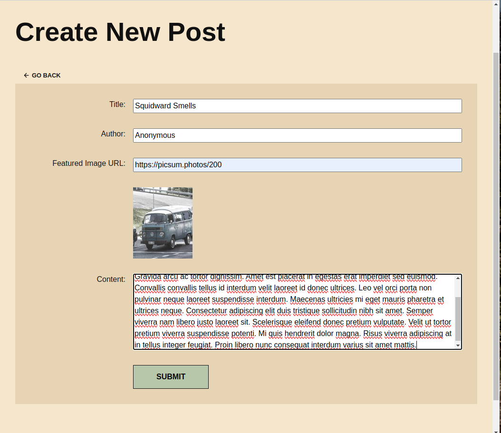
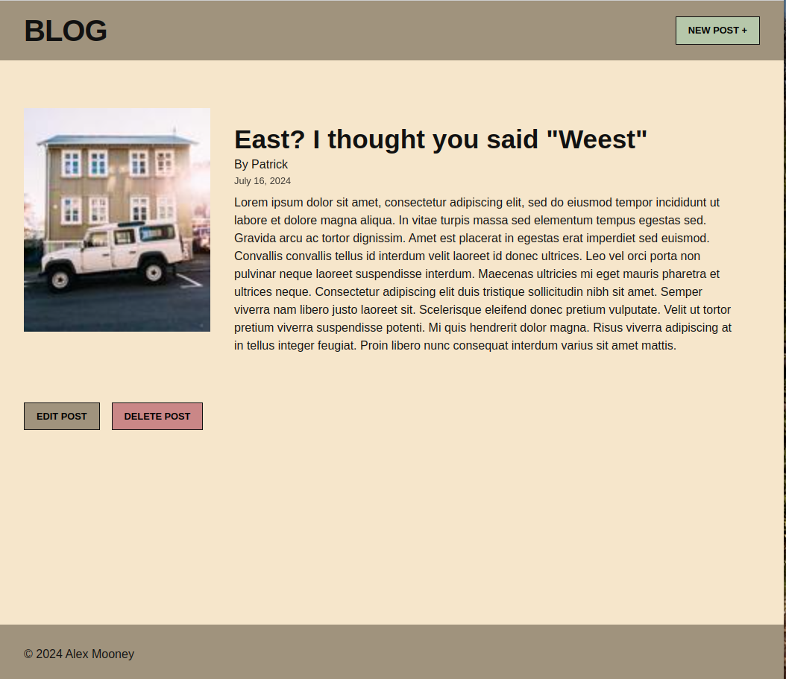
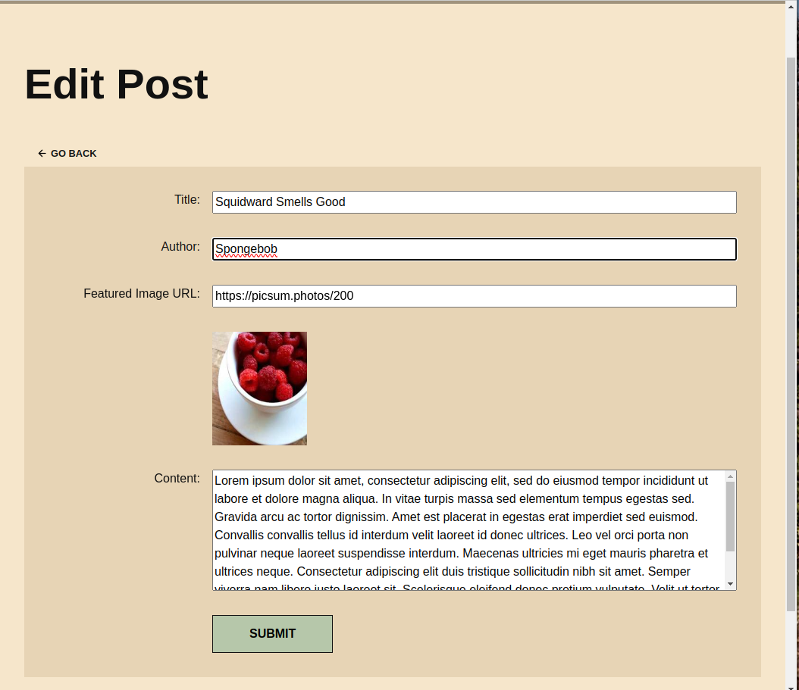
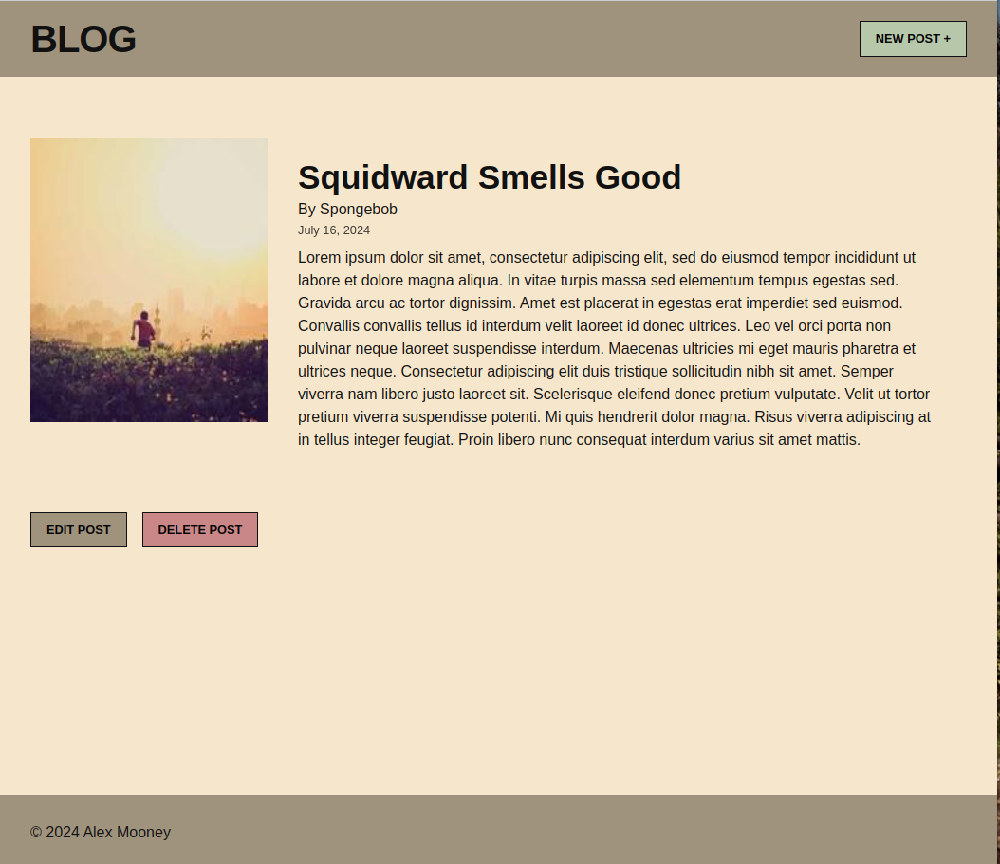

# Simple Blog

A simple multi-page blog that can create, update, and delete posts.

## Features

- Creating posts
- Editing posts
- Deleting posts
- Displaying posts in order of newest to oldest on the front page after creation
- Individual pages for each post

## Installation Instructions

To use this repository, ensure that you install all relevant node modules.

```sh
git clone https://github.com/your-username/simple-blog.git
cd simple-blog
npm install
```

## Usage Instructions

To create a new post, click the "Create Post" button at the top left. Ensure all input fields are filled out, then click submit. To edit a post, go to the home page and navigate to the post's page from the post list. From there you can edit or delete the post.

## Technologies Used

- Node.js
- Express.js
- JavaScript
- CSS
- EJS

## Contact Information

Feel free to message me on [GitHub](https://github.com/alexandermooney).

## Screenshots






